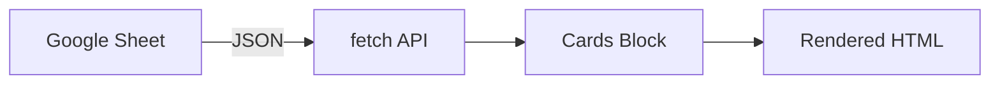

# AEM Training Materials

Generate training lab exercises, Mermaid architecture diagrams, and PPTX decks for AEM
Edge Delivery Services workshops. Follows the NYC Masterclass lab format. Code snippets
are pulled from actual block code — never fabricated.

## Lab Exercise Structure

```markdown
# Exercise N: [Title]
**Duration**: [X minutes]

<details>
<summary>Quick Navigation</summary>

- [Prerequisites](#prerequisites)
- [Background](#background)
- [Steps](#steps)
- [Verification](#verification)
- [References](#references)

</details>

## Prerequisites
[tools, branch pattern, dev server]

## Background

<details>
<summary>What You'll Learn / Why This Matters / How It Works</summary>

### What You'll Learn
- Learning objective 1

### Why This Matters
[real-world business context]

### How It Works
[conceptual explanation + optional Mermaid diagram]

</details>

## Steps

### Step 1: [Action]
[context]
1. Sub-step
   ```javascript
   // real code from the block
   ```
📸 Screenshot suggestion: [what to capture]

## Verification
- [ ] Checklist item

## References
- [Link](url)

---
[Next Exercise →](../exerciseN+1/instructions.md)
```

## Diagram-Worthy Code Patterns

Detect these in JS/CSS and flag as diagram candidates:
- `fetch(` → data flow: content source → block → rendered output
- `new Worker(` or CF/edge worker imports → request/response flow
- Multiple `import` from different origins → component/service relationship
- `new URLSearchParams` → search/filter data flow
- `hlx.json` repoless config → multi-site architecture

Render as Mermaid code blocks embedded in the MD Background section:


Use `sequenceDiagram` for request/response flows (e.g., edge workers).

## Exercise Complexity → Split Rules

- **< 50 lines, no async, no `classList.contains`** → single exercise
- **50–150 lines OR has `classList.contains` checks** → split: Ex 1 (default) + Ex 2 (variations)
- **150+ lines OR has `fetch(`, workers, or 3+ services** → suggest 2–3 exercises; confirm split with developer

## Guided Wizard

### START

**Step 1 — Gather basics** (ask together)

> "1. What is the training topic and who is the audience? (developer / author / admin / mixed)
> 2. Single exercise or full module? (full module = README overview + SETUP + multiple exercises)"

**Step 2 — Detect context**

Check if `$PWD` matches `*/blocks/<name>/` with `<name>.js` present.

If YES: read JS + CSS and analyse:
- Apply complexity split rules above
- Flag diagram candidates
- Identify screenshot spots: DA.live authoring table creation, Sidekick preview/publish, visible browser output changes

**Step 3 — Ask for outputs** (multi-select)

> "What outputs do you need?
> A) MD lab exercise file(s)
> B) Mermaid architecture diagram (embedded in MD)
> C) PPTX training deck
> Select all that apply."

**Step 4 — Present structure proposal**

> "Based on the code, I suggest:
> - Exercise 1: [Default pattern] (~X min)
> - Exercise 2: [Variations/data pattern] (~X min)
> Diagram candidate: [detected pattern]
>
> Does this split work? Any changes?"

Wait for confirmation before proceeding.

---

### MIDDLE — One piece per turn

**For each exercise:**

- **A** — Exercise title + learning objectives → confirm
- **B** — Prerequisites (tools, branch pattern `<name>--<repo>--<org>.aem.page`, dev server) → confirm
- **C** — Background section (Why this matters, How it works) → confirm or edit
- **D** — Each step with real code snippet from block → confirm, reorder, or skip. Show one step at a time:
  > "Step 2: Write the decorator. Here's the snippet from `cards.js`:
  > ```javascript
  > [actual code]
  > ```
  > Include this step?"
- **E** — At DA.live authoring moments, Sidekick actions, or visible output changes:
  > "📸 Screenshot suggestion: show the authored block table in DA.live before the code runs. Include this marker?"
- **F** — Mermaid diagram (if candidate flagged): show draft → *"Include this in the Background section?"*
- **G** — Verification checklist → confirm items

**For PPTX (if selected):**

- **H** — Proposed slide structure mapped from exercises → confirm
- **I** — *"Adobe brand template path? (provide path, or press enter to use default layout)"*
- **J** — Slide by slide content → confirm each before generating

---

### END

1. Ask: *"Filename base? (e.g., `eds-cards` → `eds-cards-ex1.training.md`, `eds-cards-ex2.training.md`, `eds-cards.pptx`)"* — remind: avoid `README.md`.

2. Ask: *"MD output format: MD only / HTML only / Both?"*

3. Run scripts:
   ```bash
   # HTML
   python3 <path-to>/aem-doc-converter/scripts/md-to-html.py <output.md> <output.html>
   # PPTX
   python3 <path-to>/aem-doc-converter/scripts/md-to-pptx.py <output.md> <output.pptx> [--template <template.pptx>]
   ```

## Notes

- Code snippets must be verbatim from the actual block file — never written from scratch.
- `📸 Screenshot suggestion` lines are markers for the developer to fill in — not generated images.
- If no block folder is detected, ask the developer to describe the architecture instead of inferring.
- Keep each exercise focused: one core concept per exercise file.
