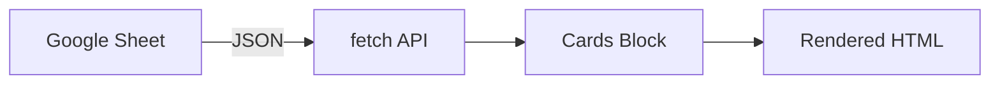

# AEM Training Materials

Generate training lab exercises, Mermaid architecture diagrams, and PPTX decks for AEM
Edge Delivery Services workshops. Follows the NYC Masterclass lab format. Code snippets
are pulled from actual block code — never fabricated.

## Interaction Rule

**Use `AskUserQuestion` at every decision point.** Never ask for freeform "yes/no" text.
Each checkpoint must be a clickable prompt. Users always get "Other" automatically.

## Lab Exercise Structure

```markdown
# Exercise N: [Title]
**Duration**: [X minutes]

<details>
<summary>Quick Navigation</summary>

- [Prerequisites](#prerequisites)
- [Background](#background)
- [Steps](#steps)
- [Verification](#verification)
- [References](#references)

</details>

## Prerequisites
[tools, branch pattern, dev server]

## Background

<details>
<summary>What You'll Learn / Why This Matters / How It Works</summary>

### What You'll Learn
- Learning objective 1

### Why This Matters
[real-world business context]

### How It Works
[conceptual explanation + optional Mermaid diagram]

</details>

## Steps

### Step 1: [Action]
[context]
1. Sub-step
   ```javascript
   // real code from the block
   ```
📸 Screenshot suggestion: [what to capture]

## Verification
- [ ] Checklist item

## References
- [Link](url)

---
[Next Exercise →](../exerciseN+1/instructions.md)
```

## Diagram-Worthy Code Patterns

Detect these in JS/CSS and flag as diagram candidates:
- `fetch(` → data flow: content source → block → rendered output
- `new Worker(` or CF/edge worker imports → request/response flow
- Multiple `import` from different origins → component/service relationship
- `new URLSearchParams` → search/filter data flow
- `hlx.json` repoless config → multi-site architecture

Render as Mermaid code blocks embedded in the MD Background section:


Use `sequenceDiagram` for request/response flows (e.g., edge workers).

## Exercise Complexity → Split Rules

- **< 50 lines, no async, no `classList.contains`** → single exercise
- **50–150 lines OR has `classList.contains` checks** → split: Ex 1 (default) + Ex 2 (variations)
- **150+ lines OR has `fetch(`, workers, or 3+ services** → suggest 2–3 exercises; confirm split

## Guided Wizard

### START

**Step 1 — Gather basics** (ask as plain text, not clickable — open-ended)

> "1. What is the training topic and who is the audience? (developer / author / admin / mixed)
> 2. Single exercise or full module? (full module = README overview + SETUP + multiple exercises)"

**Step 2 — Detect context**

Check if `$PWD` matches `*/blocks/<name>/` with `<name>.js` present.

If YES: read JS + CSS and analyse:
- Apply complexity split rules above
- Flag diagram candidates
- Identify screenshot spots: DA.live authoring table creation, Sidekick preview/publish, visible browser output changes

**Step 3 — Select outputs**

```
AskUserQuestion({
  questions: [{
    question: "Which outputs do you need for this training?",
    header: "Outputs",
    multiSelect: true,
    options: [
      { label: "MD lab exercise(s)", description: "Hands-on lab files in NYC Masterclass format" },
      { label: "Mermaid diagram", description: "Architecture diagram embedded in the MD Background section" },
      { label: "PPTX deck", description: "PowerPoint slide deck generated from the exercise content" }
    ]
  }]
})
```

**Step 4 — Confirm exercise structure**

Show the proposed split in your message (number of exercises, titles, estimated durations),
then:

```
AskUserQuestion({
  questions: [{
    question: "Does this exercise structure work?",
    header: "Structure",
    multiSelect: false,
    options: [
      { label: "Yes, looks good", description: "Proceed with this split" },
      { label: "Change the split", description: "I'll tell you how to restructure it" }
    ]
  }]
})
```

---

### MIDDLE — One piece per turn

**For each exercise:**

**A — Title + objectives**

Show the draft title and learning objectives, then:

```
AskUserQuestion({
  questions: [{
    question: "Do the title and learning objectives look right?",
    header: "Objectives",
    multiSelect: false,
    options: [
      { label: "Good, continue", description: "Move to prerequisites" },
      { label: "Edit", description: "I'll tell you what to change" }
    ]
  }]
})
```

**B — Prerequisites**

Show the drafted prerequisites (tools, branch pattern `<name>--<repo>--<org>.aem.page`,
dev server), then:

```
AskUserQuestion({
  questions: [{
    question: "Are the prerequisites correct for your environment?",
    header: "Prerequisites",
    multiSelect: false,
    options: [
      { label: "Correct, continue", description: "Use these prerequisites" },
      { label: "Edit", description: "I'll update the tools or branch pattern" }
    ]
  }]
})
```

**C — Background section**

Show the Background (Why this matters, How it works, optional Mermaid diagram), then:

```
AskUserQuestion({
  questions: [{
    question: "Does the Background section look right?",
    header: "Background",
    multiSelect: false,
    options: [
      { label: "Good, continue", description: "Move to steps" },
      { label: "Edit content", description: "I'll tell you what to change" },
      { label: "Add/remove diagram", description: "Change whether a Mermaid diagram is included" }
    ]
  }]
})
```

**D — Each step**

Show one step at a time with the real code snippet from the block, then:

```
AskUserQuestion({
  questions: [{
    question: "Include this step in the exercise?",
    header: "Step",
    multiSelect: false,
    options: [
      { label: "Include it", description: "Add this step to the exercise" },
      { label: "Edit it", description: "I'll tell you what to change" },
      { label: "Skip it", description: "Remove this step" }
    ]
  }]
})
```

**E — Screenshot markers**

At DA.live authoring moments, Sidekick actions, or visible output changes, show the
suggested marker, then:

```
AskUserQuestion({
  questions: [{
    question: "Include this screenshot suggestion marker?",
    header: "Screenshot",
    multiSelect: false,
    options: [
      { label: "Yes, include it", description: "Add 📸 marker at this point" },
      { label: "Skip", description: "No screenshot marker here" }
    ]
  }]
})
```

**F — Verification checklist**

Show the drafted verification items, then:

```
AskUserQuestion({
  questions: [{
    question: "Does the verification checklist cover the right outcomes?",
    header: "Verification",
    multiSelect: false,
    options: [
      { label: "Looks good", description: "Use this checklist" },
      { label: "Edit items", description: "I'll add, remove, or change items" }
    ]
  }]
})
```

**For PPTX (if selected):**

**G — Slide structure**

Show the proposed slide outline mapped from the exercises, then:

```
AskUserQuestion({
  questions: [
    {
      question: "Does the slide structure look right?",
      header: "Slides",
      multiSelect: false,
      options: [
        { label: "Yes, looks good", description: "Proceed with this outline" },
        { label: "Edit structure", description: "I'll tell you what to change" }
      ]
    },
    {
      question: "Do you have an Adobe brand PowerPoint template?",
      header: "PPTX template",
      multiSelect: false,
      options: [
        { label: "Yes, I'll provide path", description: "Use my template file for brand-compliant slides" },
        { label: "Use default layout", description: "Generate with built-in default styling" }
      ]
    }
  ]
})
```

---

### END

```
AskUserQuestion({
  questions: [
    {
      question: "What should the filename base be?",
      header: "Filename",
      multiSelect: false,
      options: [
        { label: "Use default", description: "e.g. eds-cards → eds-cards-ex1.training.md, eds-cards.pptx" },
        { label: "Custom base name", description: "I'll type the base name" }
      ]
    },
    {
      question: "Which MD output format do you need?",
      header: "MD format",
      multiSelect: false,
      options: [
        { label: "MD only", description: "Markdown lab file(s)" },
        { label: "HTML only", description: "Run md-to-html.py — renders nicely in browser" },
        { label: "Both", description: "Write .md then generate .html" }
      ]
    }
  ]
})
```

Run the appropriate scripts:
```bash
# HTML
python3 <path-to>/aem-doc-converter/scripts/md-to-html.py <output.md> <output.html>
# PPTX
python3 <path-to>/aem-doc-converter/scripts/md-to-pptx.py <output.md> <output.pptx> [--template <template.pptx>]
```

## Notes

- Code snippets must be verbatim from the actual block file — never written from scratch.
- `📸 Screenshot suggestion` lines are markers for the developer to fill in — not generated images.
- If no block folder is detected, ask the developer to describe the architecture instead of inferring.
- Keep each exercise focused: one core concept per exercise file.
